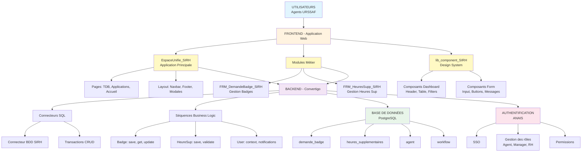
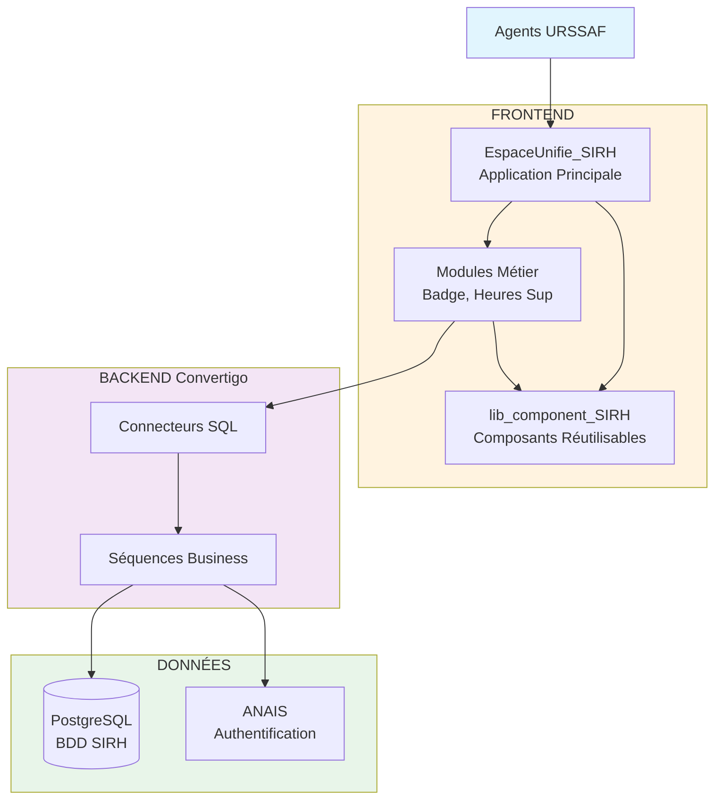
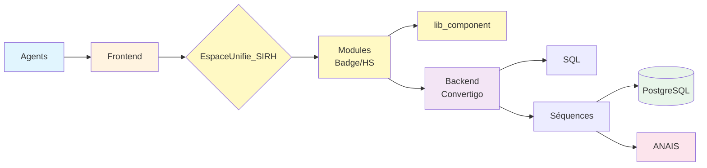
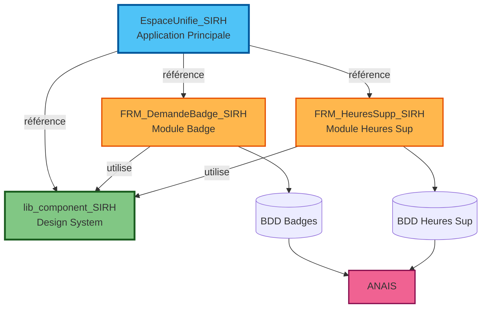

# Diagramme Mermaid - Architecture SIRH

## 📋 Instructions pour Notion :

1. Dans Notion, tapez `/code`
2. Sélectionnez "Code block"
3. Changez le langage en **Mermaid** (dans le menu déroulant en haut du bloc)
4. Copiez-collez le code ci-dessous
5. Notion générera automatiquement un beau diagramme interactif ✨

---

## 🎨 Code Mermaid à copier :

---

## 🎨 Version Alternative - Plus Simple (Vertical)

Si le premier est trop complexe, voici une version plus épurée :

---

## 🎨 Version Horizontale (Flow Left to Right)

---

## 🎨 Version avec Relations (Référencements de Projets)

---

## 💡 Comment choisir ?

- **Version 1** (Détaillée) : Pour une présentation technique complète
- **Version 2** (Simple Vertical) : Pour manager, vue d'ensemble claire
- **Version 3** (Horizontale) : Pour documents/slides en format paysage
- **Version 4** (Relations) : Pour montrer les dépendances entre projets

---

## 🚀 Astuce Notion :

Après avoir collé le code Mermaid dans un bloc `/code` avec langue "Mermaid", vous pouvez :
- Cliquer sur le diagramme généré pour l'agrandir
- Exporter en image (clic droit → Export)
- Le diagramme est interactif et zoomable !

**Quelle version préférez-vous ? Je peux aussi la personnaliser davantage ! 🎨**

