# Diagramme Mermaid - Architecture SIRH

## 📋 Instructions pour Notion :

1. Dans Notion, tapez `/code`
2. Sélectionnez "Code block"
3. Changez le langage en **Mermaid** (dans le menu déroulant en haut du bloc)
4. Copiez-collez le code ci-dessous
5. Notion générera automatiquement un beau diagramme interactif ✨

---

## 🎨 Code Mermaid à copier :

```mermaid
graph TD
    A[UTILISATEURS<br/>Agents URSSAF] --> B[FRONTEND - Application Web]
    
    B --> B1[EspaceUnifie_SIRH<br/>Application Principale]
    B1 --> B1a[Pages: TDB, Applications, Accueil]
    B1 --> B1b[Layout: Navbar, Footer, Modales]
    
    B --> B2[Modules Métier]
    B2 --> B2a[FRM_DemandeBadge_SIRH<br/>Gestion Badges]
    B2 --> B2b[FRM_HeuresSupp_SIRH<br/>Gestion Heures Sup]
    
    B --> B3[lib_component_SIRH<br/>Design System]
    B3 --> B3a[Composants Dashboard<br/>Header, Table, Filters]
    B3 --> B3b[Composants Form<br/>Input, Buttons, Messages]
    
    B1 --> C[BACKEND - Convertigo]
    B2 --> C
    
    C --> C1[Connecteurs SQL]
    C1 --> C1a[Connecteur BDD SIRH]
    C1 --> C1b[Transactions CRUD]
    
    C --> C2[Séquences Business Logic]
    C2 --> C2a[Badge: save, get, update]
    C2 --> C2b[HeureSup: save, validate]
    C2 --> C2c[User: context, notifications]
    
    C --> D[BASE DE DONNÉES<br/>PostgreSQL]
    D --> D1[demande_badge]
    D --> D2[heures_supplementaires]
    D --> D3[agent]
    D --> D4[workflow]
    
    C --> E[AUTHENTIFICATION<br/>ANAIS]
    E --> E1[SSO]
    E --> E2[Gestion des rôles<br/>Agent, Manager, RH]
    E --> E3[Permissions]
    
    style A fill:#e1f5fe
    style B fill:#fff3e0
    style B1 fill:#fff9c4
    style B2 fill:#fff9c4
    style B3 fill:#fff9c4
    style C fill:#f3e5f5
    style D fill:#e8f5e9
    style E fill:#fce4ec
```

---

## 🎨 Version Alternative - Plus Simple (Vertical)

Si le premier est trop complexe, voici une version plus épurée :

---

## 🎨 Version Horizontale (Flow Left to Right)

```mermaid
graph LR
    A[Agents] --> B[Frontend]
    
    B --> C{EspaceUnifie_SIRH}
    C --> D[Modules<br/>Badge/HS]
    D --> E[lib_component]
    
    D --> F[Backend<br/>Convertigo]
    
    F --> G[SQL]
    F --> H[Séquences]
    
    H --> I[(PostgreSQL)]
    H --> J[ANAIS]
    
    style A fill:#e1f5fe
    style B fill:#fff3e0
    style C fill:#fff9c4
    style D fill:#fff9c4
    style E fill:#fff9c4
    style F fill:#f3e5f5
    style I fill:#e8f5e9
    style J fill:#fce4ec
```

---

## 🎨 Version avec Relations (Référencements de Projets)

---

## 💡 Comment choisir ?

- **Version 1** (Détaillée) : Pour une présentation technique complète
- **Version 2** (Simple Vertical) : Pour manager, vue d'ensemble claire
- **Version 3** (Horizontale) : Pour documents/slides en format paysage
- **Version 4** (Relations) : Pour montrer les dépendances entre projets

---

## 🚀 Astuce Notion :

Après avoir collé le code Mermaid dans un bloc `/code` avec langue "Mermaid", vous pouvez :
- Cliquer sur le diagramme généré pour l'agrandir
- Exporter en image (clic droit → Export)
- Le diagramme est interactif et zoomable !

**Quelle version préférez-vous ? Je peux aussi la personnaliser davantage ! 🎨**

